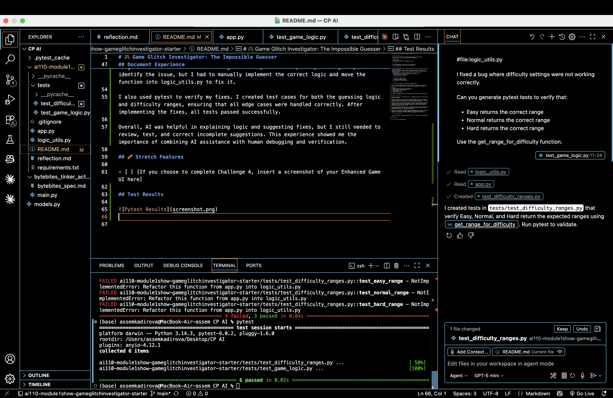

# 🎮 Game Glitch Investigator: The Impossible Guesser

## 🚨 The Situation

You asked an AI to build a simple "Number Guessing Game" using Streamlit.
It wrote the code, ran away, and now the game is unplayable. 

- You can't win.
- The hints lie to you.
- The secret number seems to have commitment issues.

## 🛠️ Setup

1. Install dependencies: `pip install -r requirements.txt`
2. Run the broken app: `python -m streamlit run app.py`

## 🕵️‍♂️ Your Mission

1. **Play the game.** Open the "Developer Debug Info" tab in the app to see the secret number. Try to win.
2. **Find the State Bug.** Why does the secret number change every time you click "Submit"? Ask ChatGPT: *"How do I keep a variable from resetting in Streamlit when I click a button?"*
3. **Fix the Logic.** The hints ("Higher/Lower") are wrong. Fix them.
4. **Refactor & Test.** - Move the logic into `logic_utils.py`.
   - Run `pytest` in your terminal.
   - Keep fixing until all tests pass!

## 📝 Document Your Experience

- [ ] Describe the game's purpose.
- [ ] Detail which bugs you found.
- [ ] Explain what fixes you applied.

## 📸 Demo

- [ ] [Insert a screenshot of your fixed, winning game here]

This is a number guessing game built with Streamlit. The player selects a difficulty level and tries to guess the secret number within a limited number of attempts.

Features:
- Multiple difficulty levels (Easy, Normal, Hard)
- Dynamic number ranges based on difficulty
- Hint system (Too High / Too Low)
- Score tracking
- Game reset functionality

The game was debugged and improved using AI-assisted development with GitHub Copilot.

## Document Experience

During this project, I used GitHub Copilot as a debugging assistant to identify and fix issues in the game.

One major bug was the hint logic, where the game incorrectly told the user to guess higher when the guess was already too high. Copilot helped identify that the comparison logic and messages were reversed, and I fixed the function accordingly.

Another issue was with difficulty settings. The game did not properly update the number range and secret value when switching difficulty levels. Copilot partially helped identify the issue, but I had to manually implement the correct logic and move the function into logic_utils.py to fix it.

I also used pytest to verify my fixes. I created test cases for both the guessing logic and difficulty ranges, ensuring that all edge cases were handled correctly. After implementing the fixes, all tests passed successfully.

Overall, AI was helpful in explaining logic and suggesting fixes, but I still needed to review, test, and correct incomplete suggestions. This experience showed me the importance of combining AI assistance with human debugging and verification.

## 🚀 Stretch Features

- [ ] [If you choose to complete Challenge 4, insert a screenshot of your Enhanced Game UI here]

## Test Results

